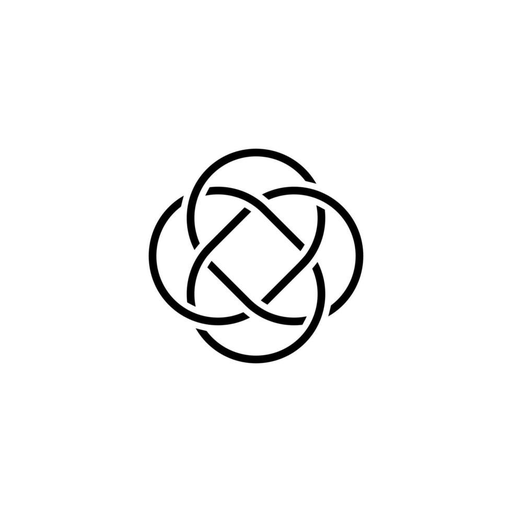

 

# IKIGAI

### *Your music. Your way.*

 

 

 

---

 

## 🎧 What is Ikigai?

Ikigai *(生き甲斐)* — the Japanese art of finding joy in life.

**Ikigai Player** is a music player that respects your library,
looks beautiful, and just works.

No subscriptions. No ads. No cloud dependency.
**Your music, on your terms.**

 

---

 

## ✨ Features

 

<table>
<tr>
<td width="50%" align="center">

### 🎵 Stream From Anywhere
**Local files** · **Jellyfin** · **Navidrome** · **YouTube Music** · **SoundCloud**

One app. Every source. Switch freely.

 

### 🎨 Beautiful Themes
Fully customizable dark themes with
dynamic color extraction from album art.

Your library sets the mood.

 

### 🎛️ Studio-Grade Sound
10-band equalizer with presets.
Channel mode. Crossfade.
Sound the way it was meant to be heard.

</td>
<td width="50%" align="center">

### 📝 Real-Time Lyrics
Synced lyrics that scroll with the music.
Plain text mode too.
Never miss a word.

 

### ⚡ Lightning Fast
Built with **Rust**. Opens instantly.
Handles 10,000+ tracks without breaking a sweat.

 

### 🎮 Stay Connected
**Discord Rich Presence** — show what you're playing.
**System Tray** — minimize and keep listening.
**Global Hotkeys** — control from anywhere.

</td>
</tr>
</table>

 

---

 

## 🔥 And There's More

 

| | | |
|:---:|:---:|:---:|
| 📥 **yt-dlp Downloads** | 🎭 **Mini Player** | 🎪 **Internet Radio** |
| 🔀 **Crossfade** | 📊 **Listening Stats** | 🎤 **Scrobble to ListenBrainz** |
| 🌍 **30+ Languages** | 🎪 **Genre Browsing** | 🔍 **Quick Search** |
| 📁 **Smart Playlists** | ⭐ **Favorites Sync** | 🎭 **Album Art Colors** |

 

---

 

## 🖥️ Built Different

 

<table>
<tr>
<td align="center" width="120">

**⚡**

*Built in Rust*
*Runs native*
*No Electron*

</td>
<td align="center" width="120">

**🎨**

*Clean UI*
*Custom themes*
*Smooth animations*

</td>
<td align="center" width="120">

**🔌**

*5 backends*
*1 app*
*Zero compromise*

</td>
<td align="center" width="120">

**🔒**

*No tracking*
*No ads*
*Open source*

</td>
</tr>
</table>

 

---

 

## ⬇️ Get Started

 

**[📥 Download for Windows](https://github.com/Garvittt-API/Ikigai-music/releases/latest/download/IkigaiPlayer-Setup.exe)**

 

*Just run the installer. Done in 30 seconds.*

 

---

 

*Made with ❤️ by Garvittt*

